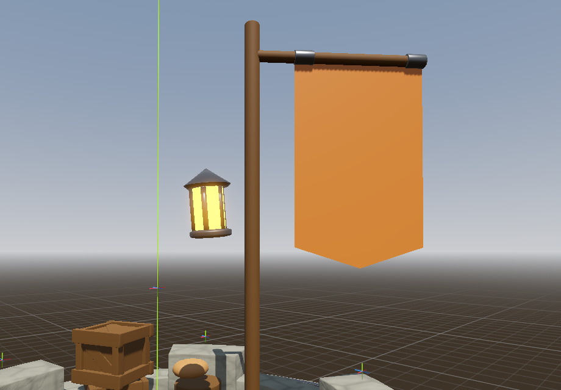

# 3D Backlog

Everything that lives in the 3D world: models, rigs, animation, VFX, shaders, lighting, atmosphere, and the tower itself. The catch-all [Backlog](backlog.md) still holds the master list; this page is for sorting the 3D work into one place.

**Status tags:** `[x]` done · `[ ]` todo · **(WIP)** in progress · **(idea)** undecided · **(check)** may already be done.

---

## Lighting & atmosphere

- [ ] **Lantern on the flag post (night lighting)** — the tower reads too dark at night. Add a lantern to the flag post as a warm light source. Needs some kind of hook / bracket / arm off the post to hang the lantern from. (Pairs with the "light the top of the tower at night" high-prio item.)

    - Suggestion: reuse the already-made rope to hang it, but decimate it first so it's not so vertex-dense.

    

- [ ]

## Tower (mesh, brick shell, damage states)

- [ ] **Cracked brick variants for damage states** — model bricks that are cracked into pieces (grouped), so damaged bricks show real fracture geometry instead of just the current colour-tint damage indication. Progressive: swap to more-broken variants as a brick's HP drops.

- [ ]

## Enemies (models, rigs, animation)

- [ ]

## VFX & shaders

### Hybrid-workflow cleanup (externalize code-built visuals) — do later, not urgent

Audit (2026-07-18) against the "code for systems, scenes for tunable visuals" rule. The codebase mostly follows it; these are the genuine stragglers — whole visual assets built in code with `.new()` and no editable resource behind them. Deferred deliberately: fine to leave while iterating fast, revisit when settling the look. Good patterns to copy: `night_lights → tiki_torch.tscn`, `spider_fire_process.tres`, `burning_ash`/`billboard_fog` (`@tool` + `@export`).

- [ ] **`Autoloads/fluid_field.gd`** — oil/flame/frost "look" block + the blood & slime **bubble color palettes hidden inside spawn functions**. Lift to a `FluidLook` resource / `@export`s (sim math stays code).
- [ ] **`Autoloads/fireflies.gd`** — whole GPUParticles swarm + fade gradient built in code, no scene. Move emitter to `fireflies.tscn`; keep only the night-fade driver.
- [ ] **`Autoloads/day_night_cycle.gd`** — ~20-color sky/sun/moon/twilight palette in code. Extract to a `DayNightPalette.tres`; orbit/threshold math stays code.
- [ ] **`VFX/Scripts/fx_wave_signal.gd`** — the entire wave flare (3 lights + 2 particle systems + materials) via `.new()`, no scene. Author a `wave_signal.tscn`; keep the lob-arc math.
- [ ] **`VFX/Scripts/fx_sparks.gd`** — full particle material rebuilt in `_ready()` behind an *empty* `fx_sparks.tscn`. Author the material/mesh on the node.
- [ ] **`enemy.gd` `_make_blood_fx()`** — bleed-drip particle (color/count/gravity/scale) in code, no scene. Extract to a `blood_drip.tscn` (mirror `spider_fire_process.tres`).
- [ ] **`Levels/Scripts/player_tower.gd`** — the goblin archer + arrow built entirely with `.new()` (body/hat/shaft colors + sizes). Move to `player_tower.tscn`; targeting logic stays code.
- [ ] **Quick win — impact-burst colors:** `rock/fire/poison/frost_effect.gd` inline `Vfx.spawn_impact(..., Color(...), power)` while `DamageEffect` already reads `item_data.ui_color` and every `ItemData.tres` carries one. Add `@export var burst_color` or read `ui_color` — kill the four inline literals. (Pure code, no open-scene risk.)
- [ ] **Lower priority:** `spike_ring.gd` (code-built cone + metal material → `spike.tscn`), `web_shooter.gd` strand color/width (`@export`), `shop_style.gd` (UI theme in code → `Theme.tres`), minor tints in `tower_core.gd` debris / `coin_pile.gd` core finish.

## Environment (terrain, foliage, skybox)

- [ ] **Flag design instead of a plain colour** — the banner on the flag post is currently a flat solid orange; give it an actual flag design / emblem (crest, sigil, pattern) via a texture or material. See the [lantern concept shot](../assets/images/lantern-flagpost-concept.png) for the current plain banner.

- [ ]

## Wizards & cart (3D)

- [ ]

## Art direction / style pass

- [ ]
